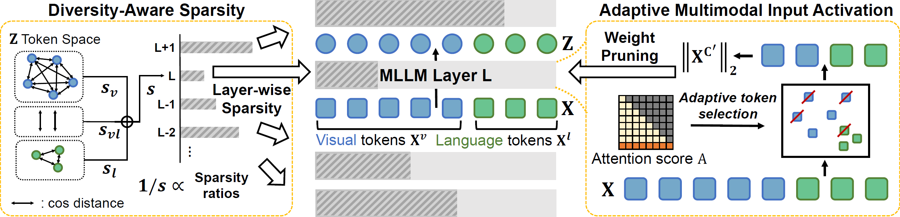

# TAMP

### **TAMP: Token-Adaptive Layerwise Pruning in Multimodal Large Language Models, preprint**
* Authors: [Jaewoo Lee](https://g-jwlee.github.io/), [Keyang Xuan](https://keyangds.github.io/), [Chanakya Ekbote](https://chanakyaekbote.netlify.app/), [Sandeep Polsetty](https://sandeep06011991.github.io/), [Yi R. (May) Fung](https://mayrfung.github.io/), [Paul Pu Liang](https://pliang279.github.io/)
* [Paper](TBD)

## Introduction

Multimodal Large Language Models (MLLMs) have grown in size to address the complexities of multimodal tasks. While beneficial for performance, their colossal model size imposes substantial computational and memory resources, limiting their practicality in resource-constrained scenarios.
Post-training model pruning effectively reduces model size by removing a massive number of parameters without compromising performance. However, most existing model compression techniques assume unimodal models, limiting their effectiveness in multimodal settings. 

We propose TAMP (Token-Adaptive Multimodal Pruning), an effective MLLM pruning pipleine that leverages multimodal token attributes to meausre layer importance for layer-wise sparsity (DAS) and computes adaptive input activations for capturing multimodal processing demands at each layer (AMIA).

<center></center>
<p>

Our method utilizes multimodal token attributes to guide MLLM pruning.

</p>

## Install
Please follow the installation instructions from [LLaVA-NeXT](https://github.com/LLaVA-VL/LLaVA-NeXT?tab=readme-ov-file) and [VideoLLaMA2](https://github.com/DAMO-NLP-SG/VideoLLaMA2/tree/audio_visual) 

## Calibration Dataset
### LLaVA-NeXT
Please download original the LLaVA-NeXT's visual instruction tuning dataset from [LLaVA-NeXT-Data](https://huggingface.co/datasets/lmms-lab/LLaVA-NeXT-Data). Prepare this in `TAMP/playground/LLaVA-NeXT-Data`. Then, split the dataset by task names. 

```shell
python llava/pruners/split_finetune_llava_next.py 
```

### VideoLLaMA2
Similarly, download the VideoLLaMA2's audiovisual instruction tuning dataset (AVInstruct) through the [AVinstruct](https://github.com/rikeilong/Bay-CAT/tree/main/AVinstruct). Place the downloaded files in `TAMP/datasets`. Then, preprocess the AVInstruct annotations files by transforming them into LLaVA-like files.
```shell
python datasets/transform_to_avinstruct.py --video_dir TAMP/datasets/path_to_video --dataset_path1 TAMP/datasets/avqa_data1.json --dataset_path2 TAMP/datasets/avqa_data2.json --save_path TAMP/datasets/avinstruct_avqa_music.json
```

## Models
In this paper, we focus on two models: [llama3-llava-next-8b](https://huggingface.co/lmms-lab/llama3-llava-next-8b) for vision-language model compression experiments and
[VideoLLaMA2.1-7B-AV](https://huggingface.co/DAMO-NLP-SG/VideoLLaMA2.1-7B-AV) for audio-visual-language model compression experiments. Please download the models in `/checkpoints` directory. <br>

## LLaVA-1.5 experiment
### Pruning
```shell
bash scripts/prune/tamp.sh
```

### Evaluation
Evaluate the pruned models with the official LLaVA-NeXT evaluation pipeline [LLaVA-NeXT](https://github.com/LLaVA-VL/LLaVA-NeXT?tab=readme-ov-file).

## VideoLLaMA2 experiment
### Pruning
```shell
bash scripts_videollama2/prune/tamp.sh
```

### Evaluation
Evaluate the pruned models with the official LLaVA-NeXT evaluation pipeline [VideoLLaMA2](https://github.com/DAMO-NLP-SG/VideoLLaMA2/tree/audio_visual).

## Bibtex
```
@article{lee2024tamp,
      title={TAMP: Token-Adaptive Layerwise Pruning in Multimodal Large Language Models},
      author={Jaewoo Lee and Keyang Xuan and Chanakya Ekbote and Sandeep Polisetty and Yi R. (May) Fung and Paul Pu Liang},
      year={2025},
      journal={arXiv preprint arXiv},
}
```
